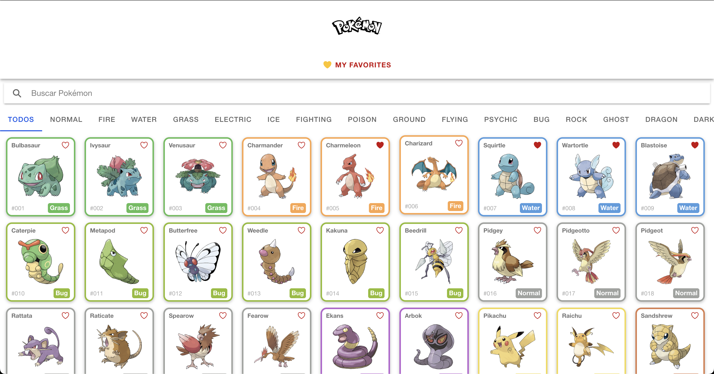
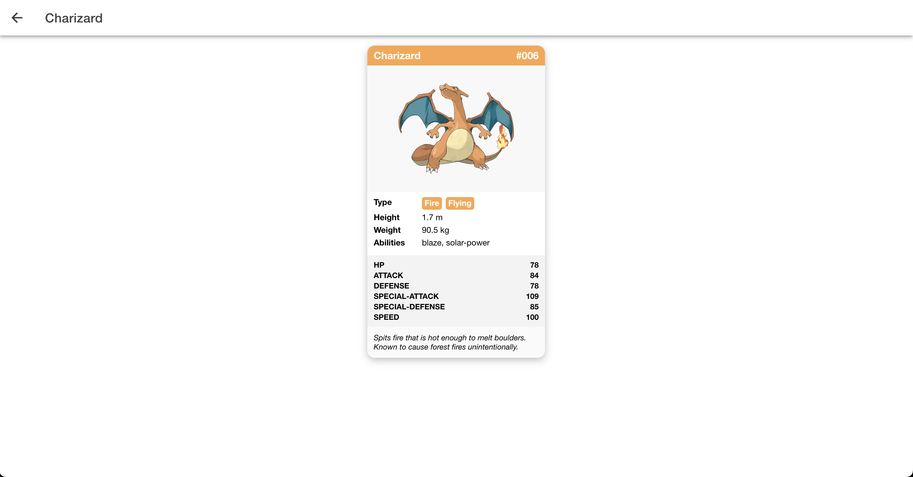
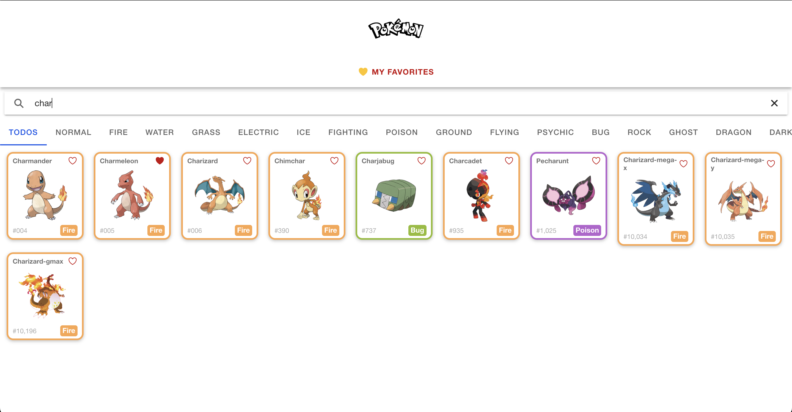
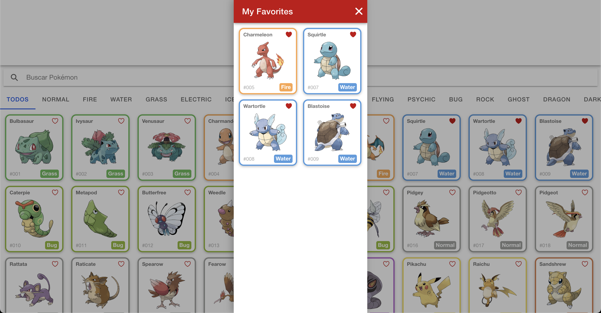

# 📱 PokéDex — Ionic + Angular

App de Pokédex mobile‑first feito em Ionic 7 stand‑alone com Angular 19 que consome a **PokeAPI** em tempo real, exibe lista paginada de Pokémon, permite busca, filtro por tipo e marcação de favoritos, além de mostrar uma carta detalhada com estatísticas completas. O design usa um mapa de cores Sass para aplicar automaticamente a cor de cada tipo em bordas, badges e filtros, garantindo identidade visual fiel ao universo Pokémon. Os favoritos ficam salvos em `localStorage` e podem ser revisados num modal lateral “My Favorites” acessível a qualquer momento. Toda a navegação é gerenciada com `provideRouter` sem NgModules, e todos os componentes são stand‑alone para reduzir boilerplate. A interface é responsiva, testada em retrato e paisagem, com animação suave nos cards e scroll infinito otimizado. Dependências externas limitam‑se ao Ionic, RxJS e `ionicons`; todo estado é gerido com services injetados pelo DI padrão do Angular. Commits seguem convenção `feat/fix/style` e cada funcionalidade está isolada em pastas `core`, `features`, `shared`. Para rodar basta `npm install` e `ionic serve`, ou `ionic build` para gerar artefatos de produção. O projeto está pronto para integração com Capacitor caso se deseje build nativo no futuro.

---

## 🚀 Tecnologias

- Ionic 7 
- Angular 19 + RxJS  
- TypeScript 
- Sass
- Ionicons

---

## 🧩 Funcionalidades

- Scroll infinito (40 por lote)  
- Busca por nome e filtro por tipo  
- Carta detalhada com 6 stats, sprite oficial e flavor text  
- Favoritar/desfavoritar com persistência local  
- Modal Central “My Favorites” responsivo  
- Cores automáticas por tipo

---

## 📁 Como rodar

```bash
git clone https://github.com/joaolrocha/pokeApi.git
cd pokeApi
npm install
ionic serve
```

---

## 📷 Screenshots

  
  


